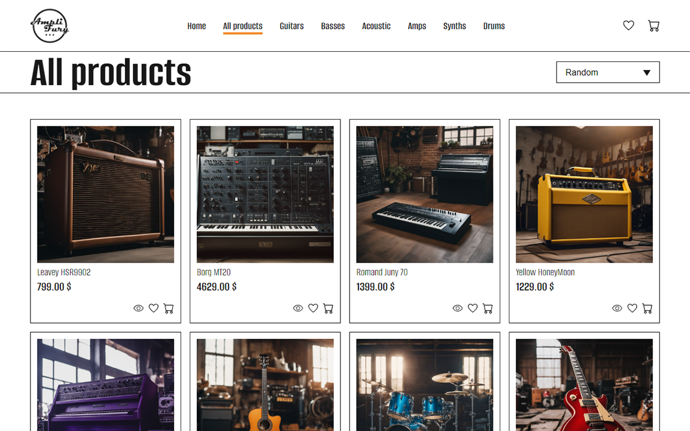

<h1 style="margin: 0 0 2rem 0; text-align: center;">
    AmpliFury-MusicStore
</h1>

<h2 style="margin: 0; color: grey; font-size: 1.5rem">
    About the project
</h2>
<div class="separator" style="width: 100%; height: 1px; background: rgba(0, 0, 0, .25);
margin-bottom: 1rem;"></div>

<p>
    AmpliFury-MusicStore is an e-commerce SPA specialized in musical instruments, built with Vue3 and NodeJs/Express. It offers an easy-to-use navigation and takes full advantage of the Vue3 framework's reactivity 
</p>

<h4 style="color: grey; font-size: 1.2rem">Built with:</h4>
<p style="margin: 0;">>> SQL database</p>
<p style="margin: 0;">>> NodeJs / Express</p>
<p style="margin: 0;">>> Vue3 / Typescript / Sass</p>

<h2 style="margin: 2rem 0 0 0; color: grey; font-size: 1.5rem">
    Installation
</h2>
<div class="separator" style="width: 100%; height: 1px; background: rgba(0, 0, 0, .25);
margin-bottom: 1rem;"></div>

<h4 style="color: grey; font-size: 1.2rem">Backend</h4>
<p style="margin: 0;">>> AmpliFury-MusicStore is an app which is connected to a backend server made with NodeJS /Express and a MySQL relationnal database. This repo only show the frontend part of the project.</p>

<h4 style="color: grey; font-size: 1.2rem">Frontend setup</h4>
<p style="margin: 0;">>> The frontend is developed using Vite and Vue3 in Typescript with Sass for styling.</p>

<h4 style="color: grey; font-size: 1.2rem">Getting started</h4>
<p style="margin: 0;">>> Clone the repository.</p>
<p style="margin: 0;">>> Install the frontend dependecies with "npm install" then run with "npm run dev".</p>

## 
```sh
npm install
```

```sh
npm run dev
```

<h4 style="color: grey; font-size: 1.2rem">Additionnal notes</h4>
<p style="margin: 0;">>> Ensure that NodeJS and npm are installed on your system.</p>

<h4 style="color: grey; font-size: 1.2rem">Project Presentation</h4>
<p style="margin: 0 0 3rem 0;">>> <strong>Demo:</strong>
To run a demo of the app, go to => https://amplifury-music-store.vercel.app/
</p>

<h2 style="margin: 2rem 0 0 0; color: grey; font-size: 1.5rem">
    Screenshots
</h2>
<div class="separator" style="width: 100%; height: 1px; background: rgba(0, 0, 0, .25);
margin-bottom: 1rem;"></div>

<div class="screenshots-container" style="display: flex; flex-direction: column; justify-content: center; align-items: center; gap: .5rem;">
    </img>
    </img>
    </img>
    </img>
    </img>
    </img>
</div>
